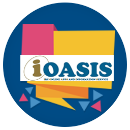

<p align="center">
    
</p>

# iOASIS
#### IRC Online Apps and Information Service (iOASIS)

iOASIS is a mobile application that integrates library content where user can connect with IRC via mobile device. The objective is to improve the accessibility of the information regarding library operation and services in a centralized manner.

[](https://expo.io/)


## Getting Started

### Pre-requisities

- **Node.js**: In order to install Expo CLI you will need to have Node.js (**we recommend the latest stable version**- but the maintenance and active LTS releases will also work) installed on your computer. [Download the recommended version of Node.js](https://nodejs.org/en/).
- **Git**: Additionally, you'll need Git to create new projects. [You can download Git from here](https://git-scm.com).

There are two tools that you need to develop apps with Expo: a local development tool and a mobile client to open your app.

## 1. Local development tool: Expo CLI

Expo CLI is a tool for developing apps with Expo. In addition the command-line interface (CLI) it also has a web-based graphical user interface (GUI) that pops up in your web browser when you start your project &mdash; you can use this if you're not yet comfortable with the using terminal or just prefer GUIs, both have similar capabilities.

### Pre-requisities

- **Node.js**: In order to install Expo CLI you will need to have Node.js (**we recommend the latest stable version**- but the maintenance and active LTS releases will also work) installed on your computer. [Download the recommended version of Node.js](https://nodejs.org/en/).
- **Git**: Additionally, you'll need Git to create new projects. [You can download Git from here](https://git-scm.com).

### Installing Expo CLI

We recommend installing Expo CLI globally, you can do this by running the following command:

```
npm install -g expo-cli
```

Verify that the installation was successful by running `expo whoami`. You're not logged in yet, so you will see "Not logged in". You can create an account by running `expo register` if you like, or if you have one already run `expo login`, but you also don't need an account to get started.

> 😳 **Running into problems?** Try searching for your error message on the [forums](https://forums.expo.io) &mdash; you're probably not the first person to encounter your issue, and the forums are a great resource for these types of problems.

### Optional: Installing Watchman

Some macOS users encounter issues if they do not have Watchman installed on their machine, so if you are using a Mac we recommend that you install it. [Download and install Watchman](https://facebook.github.io/watchman/docs/install.html).

> 💡Watchman watches files and records when they change, then triggers actions in response to this, and it's used internally by React Native. 

## 2. Mobile app: Expo client for iOS and Android

Expo client is the tool you will use to run your projects while you're developing them. When you serve your project with Expo CLI, it generates a development URL that you can open in Expo client to preview your app.

- 🤖 [Download Expo client for Android from the Play Store](https://play.google.com/store/apps/details?id=host.exp.exponent)
- 🍎 [Download Expo client for iOS from the App Store](https://itunes.com/apps/exponent)

> ⚠️ **Required operating system versions:** The minimum Android version is Lollipop (5) and the minimum iOS version is iOS 10.0.

When the Expo client is finished installing, open it up. If you created an account with `expo-cli` then you can sign in here on the "Profile" tab. This will make it easier for you to open projects in the client when you have them open in development &mdash; they will appear automatically in the "Projects" tab of the client app.

### Running the Expo client on your computer

The quickest way to get started is to run the Expo client on your physical iOS or Android device. If at some point you want to install a simulator or emulator to run the app directly on your computer you can find the [iOS simulator instructions here](../../workflow/ios-simulator/) and the [Android emulator instructions here](../../workflow/ios-simulator/). The iOS simulator only runs on macOS, Android emulators run on any major operating system.

> 🧐 Apple uses the word "simulator" for their iOS emulator and Google uses the word "emulator". This is one of your first glimpses at how each native platform expresses the same concept in its own unique way, even if the result is the same. Expo does our best to handle these differences for you and present you with a clean cross-platform API. Unfortunately we can't rename "simulator" to "emulator" or we would.

## Starting the development server

Navigate to the project folder in your terminal and type `npm start` to start the local development server of Expo CLI.

Expo CLI starts Metro Bundler, which is an HTTP server that compiles the JavaScript code of our app using [Babel](https://babeljs.io/) and serves it to the Expo app. It also pops up Expo Dev Tools, a graphical interface for Expo CLI.

> 👋 You can close the Expo Dev Tools window and disable it from starting in the future by pressing `shift+d` in your terminal running Expo CLI. Start it again at any time by pressing `d` in the terminal running Expo CLI.

## Opening the app on your phone/tablet

> 👨‍👩‍👧‍👧 You can open the project on multiple devices simultaneously. Go ahead and try it on an iPhone and Android phone at the same time if you have both handy.

- 🍎 On your iPhone or iPad, open the default Apple "Camera" app and scan the QR code you see in the terminal or in Expo Dev Tools.
- 🤖 On your Android device, press "Scan QR Code" on the "Projects" tab of the Expo client app and scan the QR code you see in the terminal or in Expo Dev Tools.

<details><summary><h4>Is the app not loading on your device?</h4></summary>
<p>

First, make sure that you are on the same wifi network on your computer and your device.

If it still doesn't work, it may be due to the router configuration &mdash; this is common for public networks. You can work around this by choosing the "Tunnel" connection type in Expo Dev Tools, then scanning the QR code again.

> 🐢 Using the "Tunnel" connection type will make app reloads considerably slower than on "LAN" or "Local", so it's best to avoid tunnel when possible. You may want to install a simulator/emulator to speed up development if "Tunnel" is required for accessing your machine from another device on your network.

</p>
</details>

## Adding New WebView Screen on Navigation Drawer

The WebView links shown in the navigation drawer is read from a constant stored in `constants/ScreenUrls.js`.

To add a new link/screen, follow these steps:
1. Go to `constants/ScreenUrls.js` and edit the file
2. You will see a similar looking code as below:
```
export default [
  {
    slug: 'iscan',
    title: 'iScan Search Engine',
    url: 'https://mulibrary.utp.edu.my/search',
  },
  {
    slug: 'account',
    title: 'My Library Account',
    url: 'https://sierra-app.utp.edu.my/iii/cas/login?service=https%3A%2F%2Fmulibrary.utp.edu.my%3A443%2Fpatroninfo~S19%2FIIITICKET&scope=19',
  },
  ...
```

Each link element should have a slug, title and a url. Therefore, to add a new link, create a new object with those following attributes and put it in a desired position/order.

Example:
```
  {
    slug: 'google',
    title: 'Google',
    url: 'https://google.com',
  }
```

After making the changes, proceed to the next section on how to build the app bundle.

## Building App Bundle
The bundle file or the apk file can be generated using the expo-cli. For uploading the update to Playstore, the bundle file should be used.

 
**Before building a new bundle/apk file. Please increment the app version in `app.json` file.**

Bundle file
```
expo build:android -t app-bundle
```

Apk file
```
expo build:android -t apk
```

After running any of the commands above, it will give a download link to the finished build of the app. Download the bundle/apk file from the link and proceed to upload the new bundle file to the Playstore.


